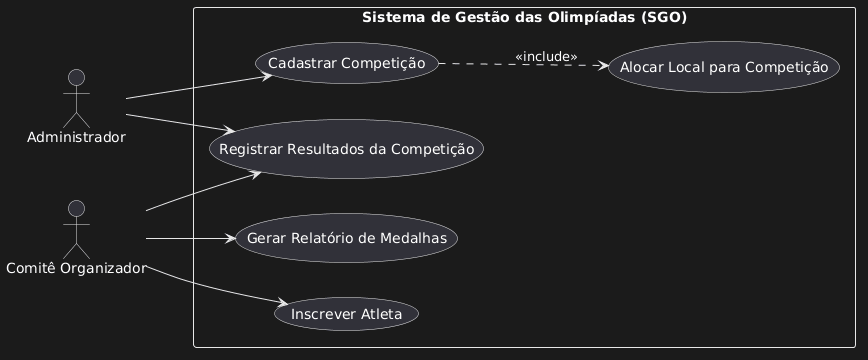
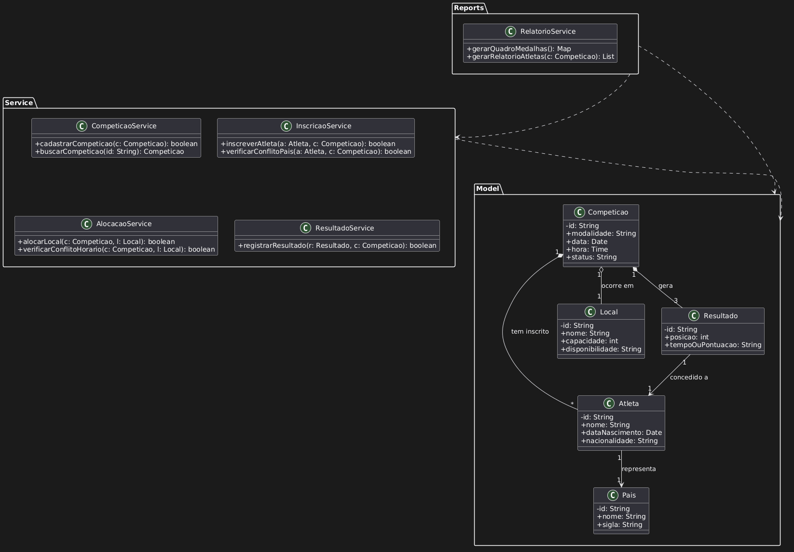
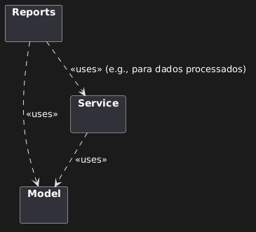
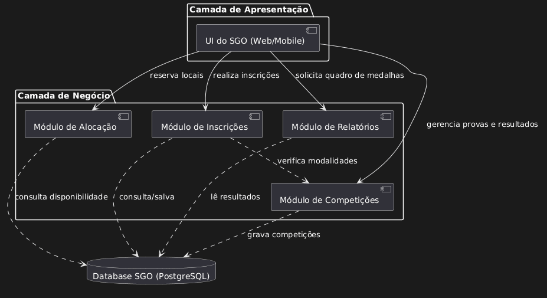

# Sistema de Gestão das Olimpíadas (SGO)

Este repositório contém a documentação técnica e os diagramas UML para o **SGO**, um sistema projetado para coordenar as competições, inscrições de atletas, alocação de locais e controle de resultados durante os Jogos Olímpicos.

## 📋 Histórias de Usuário (User Stories)

Com base nas regras de negócio, foram definidas as seguintes histórias:

*   **US01 - Gestão de Competições:** Como Administrador, eu quero cadastrar competições (modalidade, data, hora e local) para que o cronograma olímpico seja estabelecido.
*   **US02 - Inscrição de Atletas:** Como Comitê Organizador, eu quero inscrever atletas em competições, garantindo que cada atleta represente apenas um país por modalidade.
*   **US03 - Alocação de Recintos:** Como Administrador, eu quero alocar locais para as provas evitando conflitos de horário, para que cada local abrigue apenas um evento por vez.
*   **US04 - Registro de Desempenho:** Como Comitê Organizador, eu quero registrar os resultados das competições para determinar os vencedores das medalhas de Ouro, Prata e Bronze.
*   **US05 - Quadro de Medalhas:** Como Usuário do Sistema, eu quero gerar relatórios de medalhas por país para acompanhar o desempenho das delegações.

---

## 📐 Modelagem UML

Abaixo estão os diagramas que representam a arquitetura e o funcionamento do sistema.

### 1. Diagrama de Casos de Uso
Representa as interações entre os atores (Administrador e Comitê) e as funcionalidades do sistema.

### 2. Diagrama de Classes
Define a estrutura lógica do sistema, atributos e os relacionamentos entre as entidades principais.

### 3. Diagrama de Pacotes
Ilustra a organização do sistema em camadas (Model, Service e Reports).

### 4. Diagrama de Componentes
Demonstra a organização modular do software e a comunicação entre os módulos e o banco de dados.

### 5. Diagrama de Implantação
Exibe a arquitetura física e a distribuição do sistema entre dispositivos de usuário e servidores.

---

## 🛠️ Tecnologias Utilizadas
*   **UML 2.5**
*   **PlantUML** (Para geração dos diagramas)
*   **Markdown** (Documentação)

---
Projeto de Software
Cauã Homero
